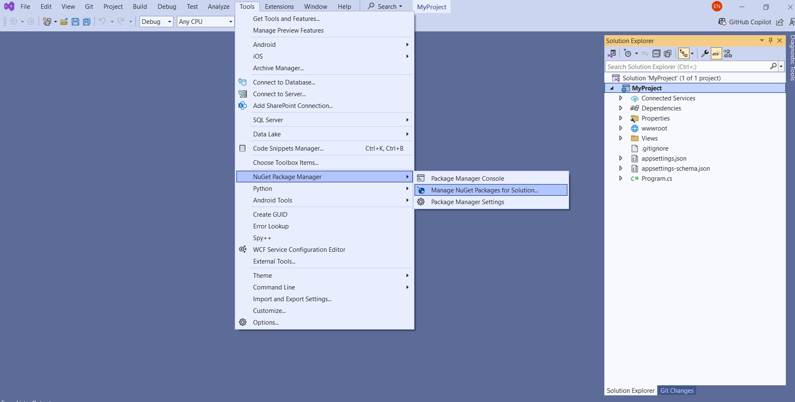

# Installation

This article covers two ways to install Umbraco Engage:

* [Via NuGet](installation.md#installation-via-nuget), or
* [Via a terminal](installation.md#installing-using-the-terminal).


Check [the requirements](../getting-started/for-developers/system-requirements.md) before you start installing Umbraco Engage.


## Installation via NuGet

Install Umbraco Engage via Nuget in your IDE such as Visual Studio, JetBrains Rider, or VSCode (With [C# DevKit](https://marketplace.visualstudio.com/items?itemName=ms-dotnettools.csdevkit)).

The example shown below uses the Nuget Package Manager in Visual Studio.

1. Open the project in Visual Studio.
2. Go to **Tools** -> **NuGet Package Manager** -> **Manage NuGet Packages for Solution**.



3. Navigate to the **Browse** tab.
4. Search for the **Umbraco.Engage** package.
5. Select the package.
6. Choose which project to install it into.
7. Install the package.

## Installing using the terminal

You can install Umbraco Engage using a terminal, like the Package Manager Console in Visual Studio. The steps for doing so are outlined below.

1. Open the project in Visual Studio.
2. Find and open the Package Manager Console from the Tools menu.
3. Type the following into the terminal:

```console
PM> install-package Umbraco.Engage
```

Alternatively, Umbraco Engage can be installed via the console on your operating machine.

1. Open a terminal window on your operating system.
2. Navigate to the folder containing your Umbraco website.
3. Install the Umbraco Engage Nuget package with the following command:

```console
dotnet add package Umbraco.Engage
```


If you have any trouble, please go to [Troubleshooting installs](troubleshooting-installs.md).


## Next steps

 (1).png>)

When you have installed Umbraco Engage, build or restart your website, and the **Marketing** section will appear in the backoffice, as shown above.

The next step is to [configure a license](licensing.md).

It is recommended to consider the information detailed in the section below, to get the best out of Umbraco Engage.

### Umbraco Forms

If you have installed **Umbraco Forms** as well and want to automatically track submissions of Umbraco Forms. Please install the package [Umbraco.Engage.Forms](https://www.nuget.org/packages/Umbraco.Engage.Forms) via NuGet as well using your preferred approach as above.

PUT THE FOLLOWING TWO INTO TABS



```
PM> install package Umbraco.Engage.Forms
```



```console
dotnet add package Umbraco.Engage.Forms
```



### Clientside tracking

To capture events that happen on the clientside (frontend) of your website, you need to add the [clientside tracking script](../developers/analytics/client-side-events-and-additional-javascript-files/additional-measurements-with-the-analytics-scripts.md). This is done by including the following snippet on all of your pages.

```html
<script src="/Assets/uMarketingSuite/Scripts/uMarketingSuite.analytics.js"></script>
```

### Cockpit

Cockpit is a tool to help with testing segments and diagnose the data Umbraco Engage collects. It can be viewed on the frontend of your website, only if you are logged into Umbraco as well.

Install cockpit on your website by adding the following Razor Partial View in your templates in Umbraco before the closing `</body>` tag

```html
@Html.Partial("uMarketingSuite/Cockpit")</body>
```

Learn more [what Cockpit is and how you can use](../getting-started/for-marketers-and-editors/cockpit.md) it.

### Optional Extras

Here are some optional extras you can do to improve your experience with Umbraco Engage.

* Add a [Google Analytics bridging script](../developers/analytics/client-side-events-and-additional-javascript-files/bridging-library-for-google-analytics.md) that automatically sends events that you send to Google Analytics, to Umbraco Engage as well.

```html
<script src="~/Assets/uMarketingSuite/Scripts/uMarketingSuite.analytics.ga4-bridge.min.js"></script>
```

* Add the [Google Analytics blocker detection script](../developers/analytics/client-side-events-and-additional-javascript-files/google-analytics-blocker-detection.md). This gives you insights in which page traffic Umbraco Engage will track, and Google Analytics will not track.

```html
<script src="/Assets/uMarketingSuite/Scripts/uMarketingSuite.analytics.blockerdetection.js"></script>
```

### Cookie consent

If you need to influence the default [The Umbraco Engage cookie](../marketers-and-editors/introduction/the-umbraco-engage-cookie.md) behaviour please go [here](../security-and-privacy/gdpr/). Or go to an example [implementation using Cookiebot](../../../security-privacy/gdpr/how-to-become-gdpr-compliant-using-cookiebot/) which can be used as an example for other cookie consent providers.\\


If you [change the default cookie behaviour](../developers/introduction/the-umbraco-engage-cookie/) make sure to perform a **client side reload of the initial page after cookie consent**. If this is not done, visitor referrer and/or campaigns will not be tracked.


### Load balancing and CM / CD environments

Are you using a load-balanced setup or separate CM and CD environments? [Please check our documentation about this topic](../getting-started/for-developers/loadbalancing-and-cm-cd-environments.md).
