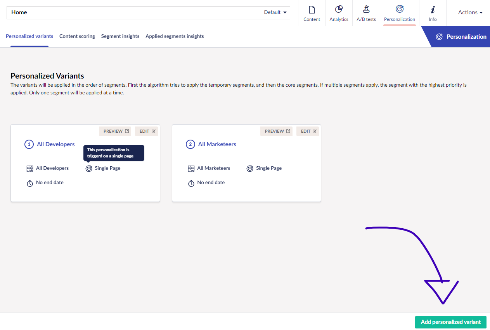

# Setting up Personalization


Please make sure you have set up[ your first segment](creating-a-segment.md). A segment is a group of visitors for which you want to personalize the website experience.

Once that is done we can go to the next step and personalize the experience.


## Applying personalization

You can apply personalization in two ways:

* On a specific page
* Via the personalization section

### Personalizing a specific page

To personalize a specific page you can go the any node within Umbraco. When you open the node you'll find all Umbraco Engage content apps on that specific node. To personalize the page you can go to the "**Personalization**" content app:

By clicking on the content app you go to an overview of all applied personalizations for this specific page. You can create your first personalization by clicking "**Add personalized variant**":

In the popup you can specify the segment for which you want to personalize the experience. It also advised to create a descriptive name for the personalization and a short description:

When you've selected the correct segment you can click on "**Add variant**". This opens up the split-view editor on the left side of the original page. On the right side, there is the option to create a personalized variant.

Depending on your segmentation setup of the document types you can edit the specific properties of your Document Type. Please read the section "[Setting up the Document Type for splitview editing](../ab-testing/types-of-ab-tests/single-page-ab-test.md)" to set this up correctly.

You can for example specify a different title for this variant:

You can save and preview your applied personalization by clicking "**Save & Preview**".

You will see an extra querystring parameter in the URL when previewing the personalization:\
`https://<your url>/?engagePreviewAppliedPersonalization=<id>`

This is only the case when previewing your personalization. As soon as you publish the page regular visitors will only see one URL an depending on the segment they will see different content.

If we now publish the website and go to the URL we will see different pages. The visitors who are part of the segment will see the personalized variant. All other visitors will see the default content.

we have now set up our first personalization.

## Applying personalization to multiple pages or per Document Type

You can also apply personalization to multiple pages at once. This can only be setup via the Marketing section in Umbraco. Within that section you can go to the subsection "**Personalization**" and click on "**Apply new personalization**":

Here you can specify to which pages or document types you want to apply the personalization. Also you need to specify for which segment this is triggered.

With multiple pages and Document Types you can either add in some additional `CSS` or `JavaScript` code or personalize the experience via code. You can add CSS `JavaScript` via the button "**Include CSS/JavaScript**". The `CSS` and `JavaScript` will automatically be added to the pages where the segment applies.
