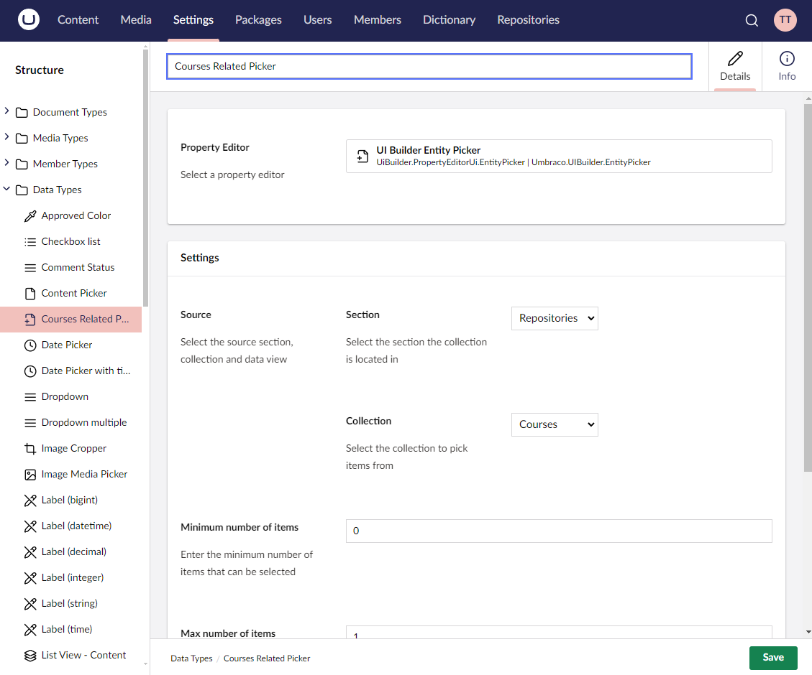

# Related Collections


This page is a work in progress and may undergo further revisions, updates, or amendments. The information contained herein is subject to change without notice.


Related collections add support for editing **many-to-many** relationships with UI Builder. These are found when multiple entities from one collection are associated with multiple entities from another. They are modeled in a database via two tables related to a junction table.

A classic example is with `Students` and `Courses`.  Each course has many students, and each student takes many courses.




## Collections Representation

A representation of your collections would look like this:


And the entities would be represented using the following Models:

```csharp
[TableName("Students")]
[PrimaryKey("Id")]
public class Student
{
    [PrimaryKeyColumn]
    public int Id { get; set; }

    public string FirstName { get; set; }

    public string LastName { get; set; }

    public string Email { get; set; }
}
```

```csharp
[TableName("Courses")]
[PrimaryKey("Id")]
public class Course
{
    [PrimaryKeyColumn]
    public int Id { get; set; }

    public string Title { get; set; }

    public string Description { get; set; }
}
```

```csharp
[TableName("StudentsCourses")]
[PrimaryKey(new[] { "StudentId", "CourseId" })]
public class StudentCourse
{
    [PrimaryKeyColumn]
    public int StudentId { get; set; }

    [PrimaryKeyColumn]
    public int CourseId { get; set; }
}
```

## Defining a related collection

You can get started with related collection through a two step process:
1. Add collection definition
2. Add related collection entity picker and definition

### Collection definition

Define a related collection by calling the `AddRelatedCollection` method on a given collection config builder instance.

### **AddRelatedCollection&lt;TEntityType, TRelatedEntityType, TJunctionEntityType&gt;(Expression&lt;Func&lt;TRelatedEntityType, object&gt;&gt; idPropertyExpression, string nameSingular, string namePlural, Action&lt;RelationConfigBuilder&lt;TBuilder, TEntity, TRelatedEntityType, TJunctionEntityType&gt;&gt; relationConfig)**

Adds a related collection to the current collection with the given names, descriptions, and default icons. A property accessor expression is required for the entity ID field of the entity. The relation configuration will define the junction entity by specifying the references to parent and child entities.

```csharp
collectionConfig.AddRelatedCollection<Student, Course, StudentCourse>(x => x.Id, "Student Course", "Students Courses", relationConfig =>
{
    relationConfig
        .SetAlias("studentsCourses")
        .SetJunction<StudentCourse>(x => x.StudentId, y => y.CourseId);
});
```

### Configuring a related collection entity picker

Define the child collection entity picker by calling the `AddRelatedCollectionPickerField` method on the parent collection fieldset config.

### **AddRelatedCollectionPickerField&lt;TValueType&gt;(string alias, string dataTypeName, string label)**

Adds an entity picker with the specified Data Type name to the editor of the parent collection.

```csharp
collectionConfig.Editor(editorConfig =>
{
    editorConfig.AddTab("General", tabConfig =>
        tabConfig.AddFieldset("General", fieldsetConfig =>
        {
            fieldsetConfig.AddField(x => x.FirstName).MakeRequired();
            fieldsetConfig.AddField(x => x.LastName).MakeRequired();
            fieldsetConfig.AddField(x => x.Email).MakeRequired();

            fieldsetConfig.AddRelatedCollectionPickerField<Course>("studentsCourses", "Courses Related Picker", "Courses");
        }));
});
```


**Relation Config Alias:** The relation config alias must correspond to the related collection picker field alias! (e.g. `studentsCourses`)

